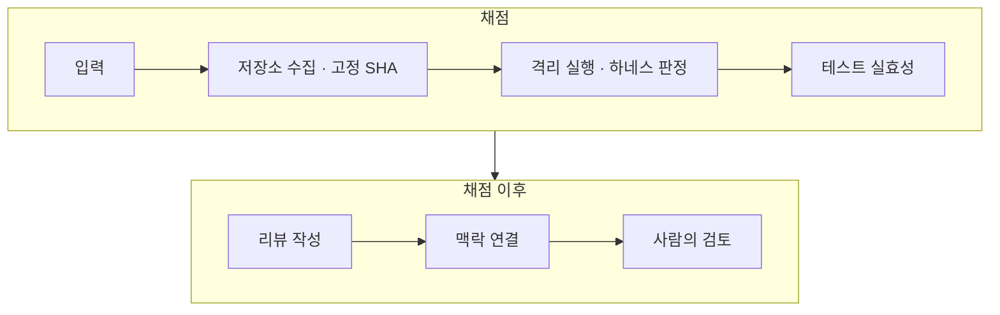

# ohmyti · CodeGraph Reviewer

채용 코딩 과제 제출물을 격리 환경에서 실제로 실행해 요구사항을 판정하고, 감점된 실패를 재생하며, 코드 근거를 보여주는 채점 워크벤치입니다.

[서비스 바로가기](https://ohmyti.vercel.app) · [ohmyti 저장소](https://github.com/wanted-hack-inchyangv/ohmyti)

---

## ohmyti는 무엇을 하나요

- 이력서 PDF, GitHub 프로필 URL, 과제 저장소 URL 세 가지를 입력받습니다.
- 과제 저장소를 격리 환경에서 실제로 실행해 요구사항별로 `PASS / FAIL / PARTIAL / INCONCLUSIVE`를 판정합니다.
- 감점된 항목은 재현 입력, 요청·응답 타임라인, 코드 위치까지 그대로 재생합니다.
- 제출 테스트가 실제 결함을 잡아내는지 mutation(결함 주입)으로 따로 검증합니다.
- 채점과는 분리된 단계에서 이력서의 주장과 GitHub 공개 저장소의 근거를 연결하고 후속 질문을 제안합니다. 이력서가 달라져도 과제 채점 결과는 바뀌지 않습니다.

---

## 테스트 페르소나

아래 페르소나는 ohmyti를 시험하기 위해 제작한 가상 인물이며, 실존하는 인물·회사와 관련이 없습니다. 세 명 모두 같은 채용 과제인 주문·재고 API([SPEC.md](https://github.com/wanted-hack-inchyangv/ohmyti/blob/main/samples/order-api/SPEC.md))를 제출했고, 수준에 따라 서로 다른 결함이 설계되어 있습니다.

| 페르소나 | 저장소 | 설계된 채점 결과 |
| --- | --- | --- |
| [**한서진**](https://github.com/wanted-hack-inchyangv/ohmyti/blob/main/samples/personas/seojin/persona.md) (`seojin`) 7년차 시니어 백엔드 | [`seojin-order-api`](https://github.com/wanted-hack-inchyangv/seojin-order-api) 과제 제출물 · Node.js 내장 http, 키별 직렬화 큐 [`seojin-stock-reservation`](https://github.com/wanted-hack-inchyangv/seojin-stock-reservation) 포트폴리오 · 재고 선점 서비스, 낙관적 잠금 [`seojin-idempotency-kit`](https://github.com/wanted-hack-inchyangv/seojin-idempotency-kit) 포트폴리오 · 멱등성 키 미들웨어 | R-01 ~ R-10 전부 통과 실행 기준 전 항목 PASS |
| [**오태윤**](https://github.com/wanted-hack-inchyangv/ohmyti/blob/main/samples/personas/taeyun/persona.md) (`taeyun`) 3년차 주니어 백엔드 | [`taeyun-order-api`](https://github.com/wanted-hack-inchyangv/taeyun-order-api) 과제 제출물 · Express + zod [`taeyun-room-booking`](https://github.com/wanted-hack-inchyangv/taeyun-room-booking) 포트폴리오 · 회의실 예약 API [`taeyun-til-cli`](https://github.com/wanted-hack-inchyangv/taeyun-til-cli) 포트폴리오 · TIL 마크다운 CLI | R-06, R-07 실패 멱등 키 충돌 · 같은 키 동시 요청 |
| [**문가은**](https://github.com/wanted-hack-inchyangv/ohmyti/blob/main/samples/personas/gaeun/persona.md) (`gaeun`) 신입, 부트캠프 수료 | [`gaeun-order-api`](https://github.com/wanted-hack-inchyangv/gaeun-order-api) 과제 제출물 · Express [`gaeun-todo-react`](https://github.com/wanted-hack-inchyangv/gaeun-todo-react) 포트폴리오 · React 할 일 앱 [`gaeun-bookmark-api`](https://github.com/wanted-hack-inchyangv/gaeun-bookmark-api) 포트폴리오 · 북마크 CRUD API | R-04, R-05 ~ R-07, R-09 실패 입력 검증 · 멱등성 전체 · 취소 시 재고 복구 |

세 페르소나의 GitHub 프로필 URL은 모두 이 조직([wanted-hack-inchyangv](https://github.com/wanted-hack-inchyangv))을 가리킵니다. 페르소나별 이력서 PDF와 설명 문서는 [samples/personas](https://github.com/wanted-hack-inchyangv/ohmyti/tree/main/samples/personas)에 있습니다.

---

## 직접 실행해 보는 방법

1. [ohmyti.vercel.app/submissions/new](https://ohmyti.vercel.app/submissions/new)에 접속합니다.
2. 이력서 PDF를 업로드합니다. 페르소나별 이력서는 `samples/personas/<핸들>/resume.pdf`이며, 입력값 전체는 같은 디렉터리의 `persona.md` "입력값" 표에 정리되어 있습니다.
3. 채점할 과제 저장소의 GitHub URL과 지원자의 GitHub 프로필 URL을 입력합니다. 위 표의 저장소로 바로 시험해 볼 수 있습니다.
4. 분석 및 채점을 실행하면 요구사항별 판정과 실패 재생, 코드 근거를 워크벤치에서 확인할 수 있습니다.

---

과제 점수는 실행 근거로만 만들어지고, 이력서와 GitHub 근거는 그 다음 단계에서 따로 연결됩니다. 궁금한 감점이 있다면 클릭해서 직접 확인해 보세요.

